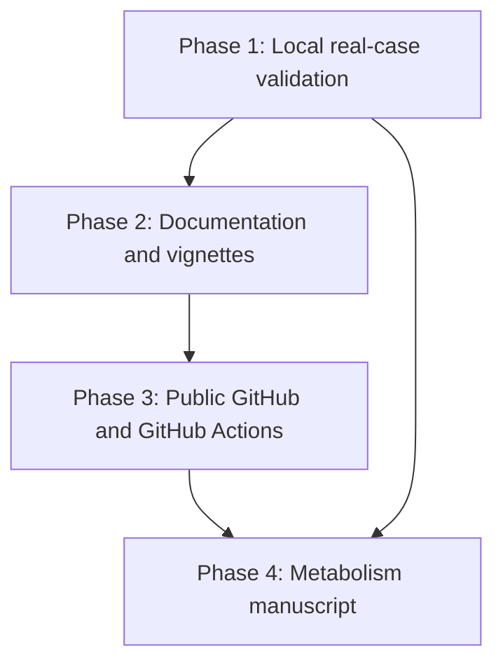

# TASKS

Updated: 2026-05-22

This folder tracks the future development roadmap for `MetaboResolveR`.

## Confirmed Decisions

- Real-case metabolomics data are **local-only** and must not be committed to
  GitHub. The official workbook currently reads as 1,416 data rows in R.
- The official real-case input is a local private `.xlsx` workbook named
  `meta_intensity_all_hmdb_kegg_lipidmaps.xlsx`. Set
  `PLASMA_ANNOTATER_REAL_CASE_XLSX` locally when running the private workflow.
- GitHub repository target: **public**.
- Manuscript first target journal: **Metabolism**.

## Task Files

1. [00-mainline.md](00-mainline.md): overall project mainline.
2. [01-real-case-testing.md](01-real-case-testing.md): local real data testing.
3. [02-documentation-vignettes.md](02-documentation-vignettes.md): R docs and vignettes.
4. [03-git-github-actions.md](03-git-github-actions.md): Git, GitHub, CI.
5. [04-metabolism-manuscript.md](04-metabolism-manuscript.md): manuscript path for `Metabolism`.

## Phase Order

## Quality Gates For Every Phase

- `pkgload::load_all("."); testthat::test_dir("tests/testthat")` passes.
- `lintr::lint_package()` reports no lints.
- `R CMD build .` succeeds.
- `R CMD check --no-manual MetaboResolveR_*.tar.gz` returns `Status: OK`.
- Local-only real data stay outside git history.
- Each completed phase writes a short changelog entry.
